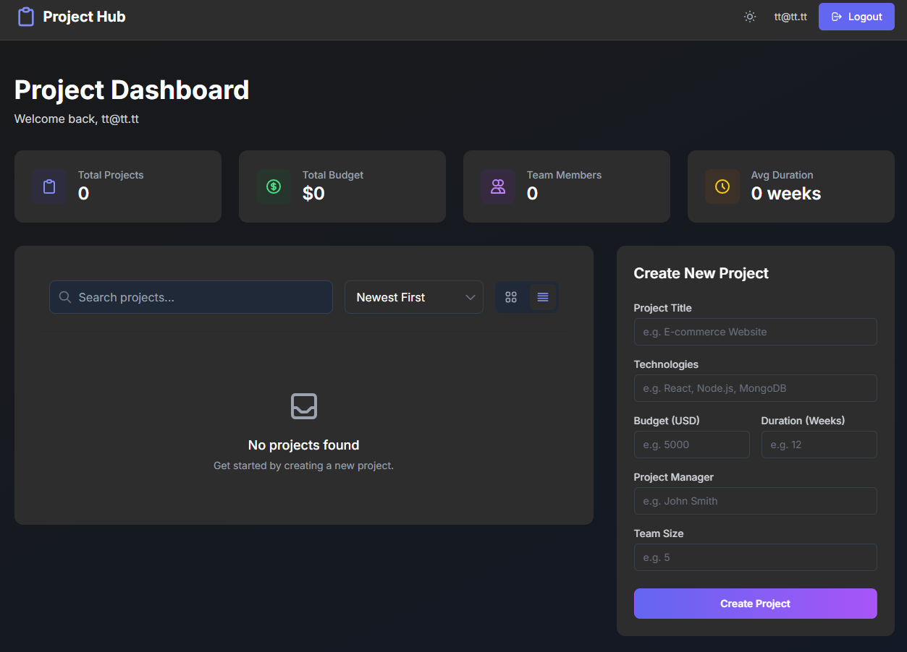
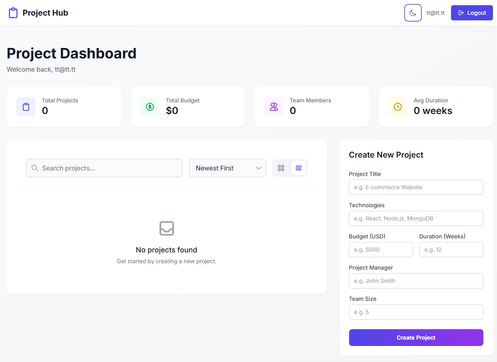

# Project Management Dashboard

A modern, responsive project management dashboard built with React and Tailwind CSS, featuring both light and dark modes.



### 📸 Screenshots

<details>
<summary>View More Screenshots</summary>

#### Dark Mode Dashboard
        

#### Light Mode Dashboard


</details>

## 🌟 Features

- **Authentication System**
  - Secure user registration and login
  - JWT-based authentication
  - Protected routes

- **Project Management**
  - Create, read, update, and delete projects
  - Track project budgets, duration, and team size
  - Real-time statistics and overview
  - Search and filter functionality

- **Modern UI/UX**
  - Responsive design for all devices
  - Dark/Light mode support
  - Interactive cards and components
  - Smooth transitions and animations
  - Grid and list view options

- **Dashboard Analytics**
  - Total projects overview
  - Cumulative budget tracking
  - Team size monitoring
  - Average project duration

## 🚀 Technologies Used

- **Frontend**
  - React.js
  - Tailwind CSS
  - Context API for state management
  - Moment.js for date handling

- **Backend**
  - Node.js
  - Express.js
  - MongoDB
  - JWT Authentication

## 💻 Installation

1. Clone the repository: 
bash
git clone https://github.com/rayenfassatoui/management.git
2. Install dependencies for frontend:
bash
cd front
npm install
3. Install dependencies for backend:
bash
cd back
npm install
4. Create a `.env` file in the backend directory with:
```env
PORT=4000
MONGO_URI=your_mongodb_connection_string
SECRET=your_jwt_secret
```
5. Start the development servers:

Frontend:
```bash
cd front
npm start
```

Backend:
```bash
cd back
npm run dev
```

## 🎨 Color Scheme

- Primary Colors:
  - Indigo (`#4F46E5`)
  - Purple (`#7C3AED`)
- Accent Colors:
  - Green (`#10B981`)
  - Yellow (`#FBBF24`)
- Dark Mode Colors:
  - Background (`#111827`)
  - Card (`#1F2937`)

## 📱 Responsive Design

- Mobile-first approach
- Breakpoints:
  - sm: 640px
  - md: 768px
  - lg: 1024px
  - xl: 1280px

## 🔒 Security Features

- JWT Authentication
- Password hashing
- Protected API routes
- Input validation
- XSS protection

## 🔄 State Management

- React Context API for global state
- Custom hooks for authentication and projects
- Real-time updates using context

## 🎯 Future Enhancements

- [ ] Add project categories
- [ ] Implement task management
- [ ] Add team member profiles
- [ ] Include project timeline visualization
- [ ] Add file upload functionality
- [ ] Implement real-time notifications
- [ ] Add project analytics and reports

## 📄 License

This project is licensed under the MIT License - see the [LICENSE](LICENSE) file for details.

## 👥 Contributing

Contributions are welcome! Please feel free to submit a Pull Request.

1. Fork the project
2. Create your feature branch (`git checkout -b feature/AmazingFeature`)
3. Commit your changes (`git commit -m 'Add some AmazingFeature'`)
4. Push to the branch (`git push origin feature/AmazingFeature`)
5. Open a Pull Request

## 📧 Contact

Rayen - rayenft2001@gmail.com

